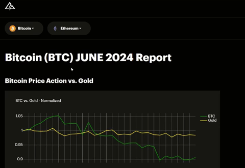

# Cryptocurrency Data Pipeline with AI Analysis

This repository contains my collection of scripts that you can use to build a fully automated cryptocurrency data pipeline. The ETL scripts extract and transform data from various free API endpoints for Bitcoin and other cryptocurrencies, and load the transformed data into your MongoDB database. This repository also contains files that are needed to run cryptocurrency monthly report interactive app by using Dash framework. On top of that, I also include a script to automate the data analysis process with the help of GPT-4o.

The monthly report pages (with all the graphs and texts) can be automatically generated once the ETL processes and AI analysis are done, thanks to my Bash script, which is also included in this repository. 

## Table of Contents

- [Usage](#usage)
- [Explanation for ETL Scripts](#explanation-for-etl-scripts)
- [Explanation for AI Analysis Script](#explanation-for-ai-analysis-script)
- [Explanation for Dash App](#explanation-for-dash-app)
- [Explanation for Bash Script](#explanation-for-bash-script)

## Usage

The process is fairly straightforward. First of all, you need to create your own `.env` file with your configuration settings for PostgreSQL and MongoDB. You should also include your API keys for TheGraph, Dune Analytics, Owlracle, and OpenAI. Please check `.env.example` to learn the structure.

Afterward, you just need to run the Bash script `execute_scripts.sh`, which will automatically execute all the Python ETL scripts, followed by the Python AI analysis script, and finally, the new monthly report pages for Bitcoin, Ethereum, and Chainlink will be automatically generated. If any script fails, it will retry after a few minutes delay. The script logs all its activities, including any failures, to `logs/results.txt`.

Make sure to check `requirements.txt` to see the required libraries.

Once you successfully run the Bash script, you can start the cryptocurrency monthly reports app locally with the command `python3 app.py`

## Explanation for ETL Scripts

There are 3 Python ETL scripts:

`btc_etl.py` - This is the ETL (Extract, Transform, Load) script for Bitcoin data. It is used to extract and transform data from three different API sources (TheGraph, Mempool, and Dune Analytics). Once the data has been processed, the transformed dataframes are automatically stored into your MongoDB database. This script also identify the current month and year, and will store them into the txt file `month_year.txt`. For example, if you run this script in June 2024, it will automatically change the text inside `month_year.txt` to "june_2024". The txt file `month_year.txt` is needed to identify the current month and year for the AI analysis process, as well as for the creation of the new report pages.

`eth_etl.py` - This is the ETL script for Ethereum data. It is used to extract and transform data from three different API sources (TheGraph, Owlracle, and Dune Analytics). Just like the Bitcoin ETL script, the transformed dataframes are stored into your MongoDB database.

`chainlink_etl.py` - This is the ETL script for Chainlink data. It is used to extract and transform data from two different API sources (TheGraph and Owlracle). Just like the Bitcoin and Ethereum ETL scripts, the transformed dataframes are stored into your MongoDB database.

Note: If you encounter any error while running any of the above Python scripts, most likely it's because you hit an API rate limit.

## Explanation for AI Analysis Script

I've included an AI analysis script for automating the data analysis process with AI (GPT-4o), which is `ai_analysis_fetch.py`. This script utilizes the module `ai_data_analysis.py` that's located in the `ai_analyzer` folder. If you want to change the AI that you want to utilize (e.g., from GPT-4o to GPT-3.5), you can check `ai_data_analysis.py`. As for changing the prompts, you can change them in `ai_analysis_fetch.py` itself.

When you run `ai_analysis_fetch.py`, it basically extracts the documents from MongoDB (after they are stored from the ETL scripts), and then, the AI will analyze them and provide the analysis texts. The texts will then be stored as a new json file, which you can find in the subfolder `ai_text_result`, located inside the folder `pages`. 

This AI analysis relies on the usage of `month_year.txt` to identify which documents it needs to extract from the MongoDB database. When the script creates a new json file, the new json file will have the latest month and year in its filename (so you can separate them automatically if you run the script every month). The included JSON files in this repo, `analysis_result_april_2024.json` and `analysis_result_may_2024.json`, were also generated by this process.

## Explanation for Dash App

This repository contains files that are needed to build the monthly report interactive app, thanks to the utilization of the Dash framework. You can easily run the report app locally with the command `python3 app.py`. If you want to change the navigation bar, you can go to `shared_functions` folder and check `utils.py`.

All the pages for the app can be found inside the `pages` folder. The original pages are the ones with "_april_2024" in their filenames. The newer reports (such as the ones with "_may_2024" in their filenames) are automatically generated by the Bash script `execute_scripts.sh`. The pages here utilize the json files in `ai_text_result` subfolder for the data analysis texts below the graphs.

If you don't have any documents in your MongoDB for the older months, you may need to delete the older months' pages, and just keep the pages that you have recently generated from the ETL scripts. Below, you can find the GIF that demonstrates how the app works.

## Explanation for Bash Script

`execute_scripts.sh` - This is the Bash script that you can run to fully automate the entire workflow in the correct order (execute `btc_etl.py` -> execute `eth_etl.py` -> execute `chainlink_etl.py` -> execute `ai_analysis_fetch.py` -> automatically generate new monthly report pages and store them in the `pages` folder -> automatically create new homepage for the app). 

So, if you want to get all the data and monthly reports every month, you can simply use the command `bash execute_scripts.sh` every end of the month and that's it!
